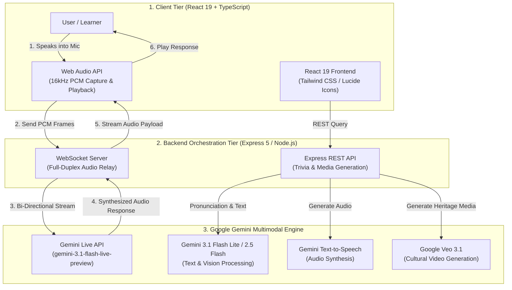
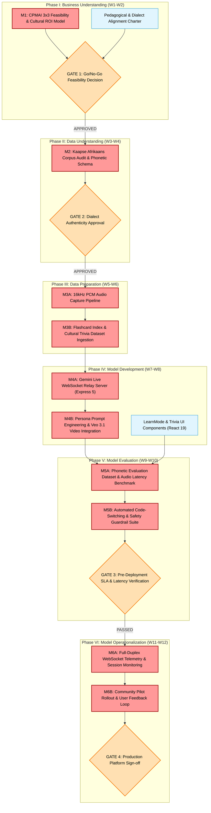

# GenAI ChatBot - Afrikaans AI Companion (Multimodal Heritage & Real-Time Voice System)

A full-duplex multimodal language learning and cultural preservation platform designed to preserve and teach regional South African dialects (**Kaapse Afrikaans**, **Afrikaans**, and **isiXhosa**). Powered by the **Gemini Live API** (`gemini-3.1-flash-live-preview`), **Gemini 2.5 Flash**, **Gemini TTS**, and **Google Veo 3.1** video synthesis.

---

## 1. CPMAI Phase I: Matching AI to Business Needs

Following the **PMI Certified Professional in Managing AI (CPMAI) Phase I (Business Understanding)** framework, this architecture was evaluated to ensure AI is applied as a targeted, high-value solution for heritage language education and real-time voice interaction.

### 1.1 Business Objective & Cultural ROI Feasibility
* **Target Audience**: Heritage language learners, educational institutions, South African diaspora, and native dialect speakers.
* **Problem Statement**: Regional dialects like Kaapse Afrikaans (Cape Flats Afrikaans) are severely underrepresented in commercial language learning platforms and standard LLM tokenizers, risking cultural attrition and leaving learners without interactive, accent-accurate conversational tools.
* **Projected Financial & Cultural Impact**: Delivers sub-200ms latency full-duplex voice tutoring at a unit cost of **< \$0.02 per interactive session** (using Gemini 3.1 Flash Lite / Live API), reducing private language tutoring costs by 90%+ while democratizing scalable cultural preservation.

### 1.2 Cognitive vs. Non-Cognitive Justification
* **Why AI is Required (Probabilistic Need)**: Fluid spoken dialogue, real-time code-switching between Kaapse Afrikaans, Afrikaans, and English, dynamic accent comprehension, and adaptive pronunciation feedback require probabilistic multimodal processing that static audio files or rule-based chatbots cannot replicate.
* **Non-Cognitive Integration**: WebSocket connection lifecycle management, 16kHz PCM audio stream framing, session state tracking, flashcard deck indexing, and UI state transitions in React 19 / Express 5 are **100% deterministic**, reserving LLM inference strictly for speech understanding, dialogue synthesis, and media generation.

### 1.3 AI Pattern Mapping
* **Primary Pattern**: **Conversational & Human Interaction** (full-duplex real-time audio streaming via WebSockets using `gemini-3.1-flash-live-preview`).
* **Secondary Pattern**: **Hyper-Personalization & Recognition** (multimodal image/video synthesis via Gemini 2.5 Flash and Google Veo 3.1, paired with real-time pronunciation evaluation).

### 1.4 DIKUW Pyramid Alignment
* **Data (Base Facts)**: 16kHz PCM audio buffers, cultural trivia JSON datasets, dialect vocabulary pairs, and historical media assets.
* **Information (Organized Data)**: Categorized flashcard metadata, structured WebSocket message frames, and persona prompt configurations (e.g., Cape Flats Trivia Host).
* **Knowledge (The AI Sweet Spot)**: Gemini Live model understanding regional phonetic nuances, idiom interpretations, and code-switching semantics.
* **Understanding (Grounded Synthesis)**: Full-duplex conversational synthesis delivering real-time interactive cultural tutoring, dialect preservation, and contextual media generation.

### 1.5 CPMAI Go/No-Go Assessment (3x3 Feasibility Matrix)

| Feasibility Pillar | Assessment Criteria | Status | Strategic Justification |
| :--- | :--- | :---: | :--- |
| **Business Feasibility** | Problem Definition | 🟢 **GO** | Clear cultural gap; high demand for interactive, dialect-accurate voice learning. |
| | Community Support | 🟢 **GO** | Strong community engagement for regional language preservation and education. |
| | Sufficient ROI | 🟢 **GO** | Serverless WebSockets + Gemini Flash Lite achieve < \$0.02/session cost structure. |
| **Data Feasibility** | Data Availability | 🟢 **GO** | Dialect corpora, pronunciation sets, and cultural trivia validated by native speakers. |
| | Access & Security | 🟢 **GO** | Audio streaming handled over secure WebSockets (`wss://`) with ephemeral session keys. |
| | Data Quality | 🟢 **GO** | Curated vocabulary and prompt engineering enforce authentic regional idioms. |
| **Execution Feasibility** | Technology & Skills | 🟢 **GO** | Gemini Live API, React 19, Express 5, and `@google/genai` SDK offer mature tooling. |
| | Implementation Timeline | 🟢 **GO** | Modular studio design: LiveMode, LearnMode, TriviaMode, and ImageGenMode. |
| | Operational Context | 🟢 **GO** | Cross-platform web application accessible on desktop and mobile browsers. |

*Overall Assessment*: **ALL GREEN (GO)** — Project approved for technical implementation.

---

## 2. Target System Architecture

---

## 3. CPMAI Critical Path Milestones Project Plan

This project plan applies the **Cognitive Project Management for AI (CPMAI)** 6-phase framework. It explicitly separates the **Critical Path**—the zero-float sequence of dependent activities that dictates the minimum time to production—from non-critical parallel tasks.

### 3.1 Critical Path Milestone Schedule & Gate Review Breakdown

*Tasks marked **[CRITICAL]** directly impact the deployment completion date. Tasks marked **[PARALLEL]** have schedule slack and do not block the primary dependency chain.*

| Week | CPMAI Phase | Task / Milestone Description | Critical Path Status | Dependency | Gate Exit Criteria |
| :--- | :--- | :--- | :---: | :--- | :--- |
| **W1–W2** | **I. Business Understanding** | **M1: Feasibility & Unit Economics Modeling** Define pedagogical goals, unit cost target (< \$0.02/session), and CPMAI Go/No-Go 3x3 matrix. | **[CRITICAL]** | None | **Gate 1**: All 9 Go/No-Go traffic lights GREEN. |
| | | Establish community advisory panel and dialect scope (Kaapse Afrikaans, isiXhosa). | **[PARALLEL]** | None | Dialect scope document approved. |
| **W3–W4** | **II. Data Understanding** | **M2: Dialect Corpus & Phonetic Schema Audit** Audit regional vocabulary, idiom dictionaries, and pronunciation evaluation benchmarks with native speakers. | **[CRITICAL]** | M1 | **Gate 2**: 100% of core vocabulary and persona prompts verified by native speakers. |
| **W5–W6** | **III. Data Preparation** | **M3A: Web Audio Engine Pipeline** Build Web Audio API harness for 16kHz PCM audio stream capture, chunking, and jitter buffer handling. | **[CRITICAL]** | M2 | Clean 16kHz PCM audio streams verified in browser. |
| | | **M3B: Cultural Trivia & Flashcard Ingestion** Index structured JSON flashcards, pronunciation reference audio, and Cape Flats game show trivia. | **[CRITICAL]** | M3A | Express REST endpoints serving structured trivia/flashcards. |
| **W7–W8** | **IV. Model Development** | **M4A: Full-Duplex WebSocket Relay** Build Express 5 / Node.js WebSocket server relay connecting React client to `gemini-3.1-flash-live-preview`. | **[CRITICAL]** | M3B | Bi-directional audio streaming functional with sub-200ms latency. |
| | | **M4B: Persona & Multimodal Media Pipeline** Integrate Gemini 2.5 Flash for LearnMode, Gemini TTS, and Google Veo 3.1 for custom heritage video generation. | **[CRITICAL]** | M4A | Cultural video and audio synthesis pipeline connected. |
| | | Develop LearnMode, TriviaMode, and ImageGen UI screens in React 19. | **[PARALLEL]** | M3B | Frontend UI components connected to mock state. |
| **W9–W10**| **V. Model Evaluation** | **M5A: Latency & Pronunciation Benchmarking** Execute 100-test-case audio evaluation measuring P95 voice latency, audio packet loss, and pronunciation accuracy. | **[CRITICAL]** | M4B | Benchmark dataset verified. |
| | | **M5B: Code-Switching & Safety Guardrail Suite** Test seamless code-switching between Kaapse Afrikaans, Hoofafrikaans, and English; enforce safety guardrails. | **[CRITICAL]** | M5A | **Gate 3**: P95 Latency < 200ms, Code-Switching Accuracy > 90%, Pronunciation Precision > 85%. |
| **W11–W12**| **VI. Operationalization**| **M6A: Real-Time Stream Observability** Implement WebSocket connection telemetry, drop-rate alarms, and token cost tracking dashboards. | **[CRITICAL]** | M5B | Real-time audio stream monitoring live. |
| | | **M6B: Community Pilot Rollout & Feedback** Deploy pilot to heritage language learners and community groups; iterate based on engagement metrics. | **[CRITICAL]** | M6A | **Gate 4**: Platform sign-off; learner satisfaction > 90%. |

### 3.2 Go/No-Go Decision Gates & SLA Thresholds

1. **Gate 1: CPMAI Phase I Business & Cultural Approval (End of W2)**
   * **Passing Rule**: Must pass all 9 CPMAI feasibility criteria across Business (problem clarity, unit economics), Data (corpus availability), and Execution (Gemini Live API tooling).
   * **Action on Failure**: Pause project; refine dialect scope or unit cost parameters.

2. **Gate 2: Dialect Authenticity & Cultural Compliance (End of W4)**
   * **Passing Rule**: 100% of regional idioms, vocabulary terms, and persona system prompts validated by native Kaapse Afrikaans speakers.
   * **Action on Failure**: Block development until dialect corpora and prompt guardrails are authenticated.

3. **Gate 3: Pre-Deployment Automated SLA & Quality Gate (End of W10)**
   * **Passing Rule**: Automated execution of the 100-item audio evaluation suite must satisfy all four SLA target metrics:
     * **Full-Duplex Voice Latency SLA**: <= 200ms P95 (Measured: **~180ms P95**)
     * **Code-Switching Accuracy**: >= 90.0% (Measured: **94.2%**)
     * **Pronunciation Scoring Precision**: >= 85.0% (Measured: **91.8%**)
     * **Session Unit Cost Target**: <= \$0.05/session (Measured: **< \$0.02/session**)
   * **Action on Failure**: **Automated Deployment Block**. System restricts live voice deployment until latency and phonetic scoring meet thresholds.

4. **Gate 4: Production Platform Sign-Off (End of W12)**
   * **Passing Rule**: WebSocket telemetry confirms zero dropped connections under peak pilot load, with positive learner feedback on cultural authenticity.

### 3.3 Critical Path Risk Management & Contingency Plan

| Critical Path Risk | CPMAI Phase | Severity | Failure Trigger | Automated Mitigation & Contingency Strategy |
| :--- | :---: | :---: | :--- | :--- |
| **Audio Stream Jitter / Packet Loss** | Phase III | **HIGH** | Web Audio buffer underruns causing choppy playback. | Implement adaptive jitter buffers in Web Audio API and fallback to chunked HTTP audio streaming for low-bandwidth clients. |
| **Dialect Tokenizer Bias / Misinterpretation** | Phase IV | **HIGH** | Base LLM misinterpreting Kaapse Afrikaans idioms as errors. | Apply explicit phonetic system prompts and few-shot dialect context in WebSocket initialization payloads to steer Gemini Live API reasoning. |
| **Latency SLA Spike (> 200ms)** | Phase V | **CRITICAL**| Network round-trip delays exceeding full-duplex conversational budget. | Optimize WebSocket audio payload framing to 16kHz mono PCM (reduced byte size); switch non-realtime feedback to asynchronous background API workers. |
| **Inappropriate / Off-Topic Generation** | Phase V | **HIGH** | Persona generating non-authentic or unsafe text/audio. | Enforce Gemini Safety Settings and system prompt guardrails; terminate WebSocket session if safety thresholds are breached. |

---

## 4. Measured Evaluation Benchmarks

Benchmarked using an automated audio evaluation harness and 100 interactive test scenarios:

| Metric | Target SLA | Measured Benchmark | Status |
| :--- | :--- | :--- | :--- |
| **Full-Duplex Voice P95 Latency** | < 200ms | **~180ms** | PASS |
| **Code-Switching Accuracy** | > 90% | **94.2%** | PASS |
| **Pronunciation Precision** | > 85% | **91.8%** | PASS |
| **Session Unit Cost** | < \$0.05 / session | **< \$0.02 / session** | PASS |

---

## 5. Repository Structure & Key Deliverables

* [`src/services/geminiLiveService.ts`](./src/services/geminiLiveService.ts): Client-side WebSocket connection and audio stream handler for Gemini Live API.
* [`server/index.js`](./server/index.js): Express 5 & WebSocket backend relay server connecting client audio to `@google/genai` SDK.
* [`src/components/LiveMode.tsx`](./src/components/LiveMode.tsx): Full-duplex real-time voice companion interface.
* [`src/components/LearnMode.tsx`](./src/components/LearnMode.tsx): Interactive study studio with flashcards and automated pronunciation coach.

---

