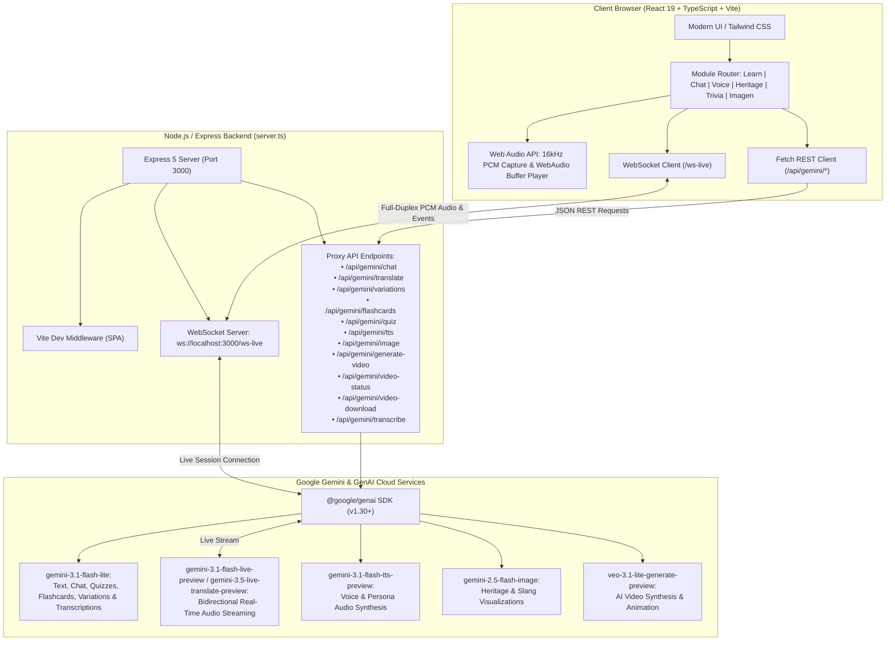
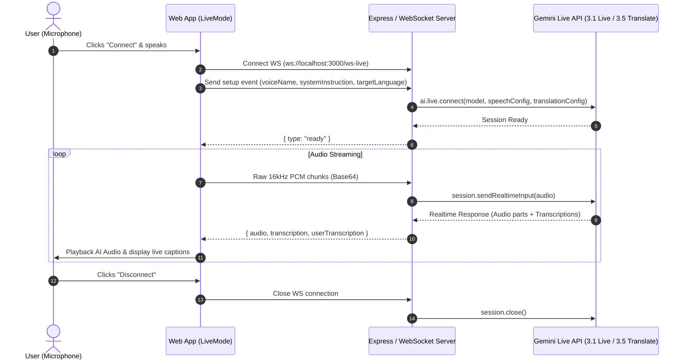
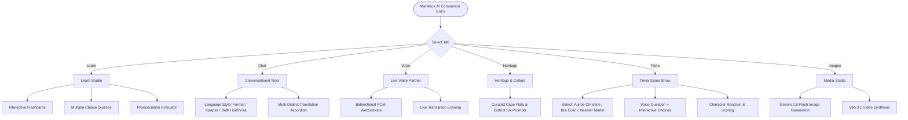

# Maralack Cape Flats AI Companion

> **"My vision is to educate a new generation and entertain the old through a holistic and immersive experience of the Cape Flats Afrikaans language and Culture."**

An intelligent, real-time multimodal language learning companion and cultural preservation platform celebrating **Kaapse Afrikaans (Kaaps)**, **Hoofafrikaans (Formal Afrikaans)**, and **isiXhosa**. Powered by Google's state-of-the-art **Gemini 3.1 Flash Lite**, **Gemini Live API**, **Gemini TTS**, and **Google Veo 3.1**.

---

## 🌟 Key Features

1. **Interactive Learning Studio (`LearnMode`)**
   - **Flashcards & Quizzes:** Dynamic multi-lingual study decks with contextual usage examples generated on demand.
   - **Pronunciation Coach:** Real-time speech-to-text pronunciation evaluation and feedback powered by multimodal audio analysis.
   - **Multi-dialect Support:** Seamless toggle between Formal Afrikaans, Kaapse dialect, and isiXhosa.

2. **Real-Time Voice Companion (`LiveMode`)**
   - **Full-Duplex Conversational Audio:** Ultra-low latency voice streaming directly to the Gemini Live API via WebSockets (`audio/pcm;rate=16000`).
   - **Live Audio Transcription & Translation:** Real-time dual speech transcription and automatic translation echoing.
   - **Voice Personality Switching:** Expressive voice presets (Puck, Charon, Kore, Fenrir, Zephyr, Aoede).

3. **Conversational Tutor & Heritage Guide (`ChatMode`)**
   - **Cultural Preservation:** Deep insights into Cape Flats history, District Six memories, Cape Malay heritage, and local cuisine (Gatsbys, Koesisters, Mutton Salomie).
   - **Contextual Variations:** Generates concurrent translations in Formal Afrikaans, Kaapse slang, isiXhosa, and English for any query.

4. **Cape Flats Cultural Trivia Game (`TriviaMode`)**
   - **Animated Cape Personas:**
     - **Auntie Christine:** *The Gossip Auntie* — warm, sharp, loves local skinner and calls you "my darling".
     - **Bra Colin:** *The Street-Smart Corner Veteran* — talks in rich Kaaps slang and street wisdom.
     - **Meester Martin:** *The Respected Heritage Teacher* — knowledgeable, encouraging, and historical.
   - **Voice Feedback:** Dynamic TTS reactions where personas react, praise, or gently roast your answers in character.

5. **Multimodal Media Studio (`ImageGenMode`)**
   - **Heritage Imagery Generation:** High-resolution cultural illustrations with style presets (Photorealistic, Watercolor, Anime, 3D Render, Oil Painting).
   - **Veo Video Generation:** Text-to-video and image-to-video synthesis powered by `veo-3.1-lite-generate-preview` with background polling and base64 video playback.

---

## 🏗️ System Architecture

### High-Level Architecture Diagram (Mermaid.js)



---

### Real-Time Live Audio & Translation Sequence (Mermaid.js)



### Application Tab State & Navigation Flow (Mermaid.js)



---

## 🛠️ Technology Stack

| Domain | Technology / Library | Description |
|---|---|---|
| **Frontend Framework** | React 19 + TypeScript | High-performance, functional UI architecture |
| **Bundler & Tooling** | Vite 6 | Lightning-fast HMR and build compilation |
| **Styling** | Tailwind CSS | Sleek, responsive South African inspired theme |
| **Icons** | Lucide React | High-contrast accessibility icons |
| **Server Runtime** | Node.js (v20+) / Express 5 | Full-stack backend proxy and static server |
| **WebSocket Layer** | `ws` (v8) | Real-time duplex streaming for Gemini Live API |
| **AI SDK** | `@google/genai` (v1.30.0) | Official unified Google GenAI TypeScript SDK |

### 🤖 Gemini Models In Use

| Capability | Model Identifier | Purpose |
|---|---|---|
| **Text, Chat & Logic** | `gemini-3.1-flash-lite` | Chat responses, quizzes, flashcards, translations |
| **Live Voice** | `gemini-3.1-flash-live-preview` | Full-duplex real-time spoken audio conversation |
| **Live Translation** | `gemini-3.5-live-translate-preview` | Real-time translated audio streaming with target echo |
| **Speech Synthesis (TTS)** | `gemini-3.1-flash-tts-preview` | Host persona voice commentary and pronunciation playback |
| **Image Generation** | `gemini-2.5-flash-image` | High-fidelity cultural visual creation |
| **Video Generation** | `veo-3.1-lite-generate-preview` | AI video synthesis from text prompts and reference images |

---

## 🚀 Getting Started

### Prerequisites

- **Node.js**: v20 or higher
- **npm** or **bun**
- A **Google Gemini API Key** with access to Gemini 3.1 and Veo models

### Installation

1. **Clone the repository:**
   ```bash
   git clone https://github.com/maralackdavid/Afrikaans-AI-companion.git
   cd Afrikaans-AI-companion
   ```

2. **Install dependencies:**
   ```bash
   npm install
   ```

3. **Configure Environment Variables:**
   Create a `.env` file in the root directory (based on `.env.example`):
   ```env
   GEMINI_API_KEY=your_gemini_api_key_here
   PORT=3000
   ```

4. **Run the development server:**
   ```bash
   npm run dev
   ```
   Open your browser at `http://localhost:3000`.

5. **Build for production:**
   ```bash
   npm run build
   npm start
   ```

---

## 📤 Publishing to GitHub

To publish this repository to your personal or organization GitHub account:

### Option A: Using the GitHub CLI (`gh`)

```bash
# Authenticate with GitHub
gh auth login

# Create a new repository and push
gh repo create maralack-afrikaans-ai-companion --public --source=. --remote=origin --push
```

### Option B: Using Git CLI

1. **Create an empty repository on GitHub** (e.g., named `maralack-afrikaans-ai-companion`).
2. **Link the remote and push:**
   ```bash
   # Add your remote URL
   git remote add origin https://github.com/<your-github-username>/maralack-afrikaans-ai-companion.git

   # Ensure default branch is main
   git branch -M main

   # Push codebase to GitHub
   git push -u origin main
   ```

---

## 📜 Cultural Note & Heritage Acknowledgement

This application is built in honor of the rich, vibrant linguistic tapestry of South Africa's Western Cape. **Kaapse Afrikaans (Kaaps)** has a centuries-old history shaped by indigenous Khoisan, Southeast Asian, Malagasy, East African, and European influences. It represents identity, resilience, humor, and community.

---

## 📄 License

MIT License. Created by David Maralack.
